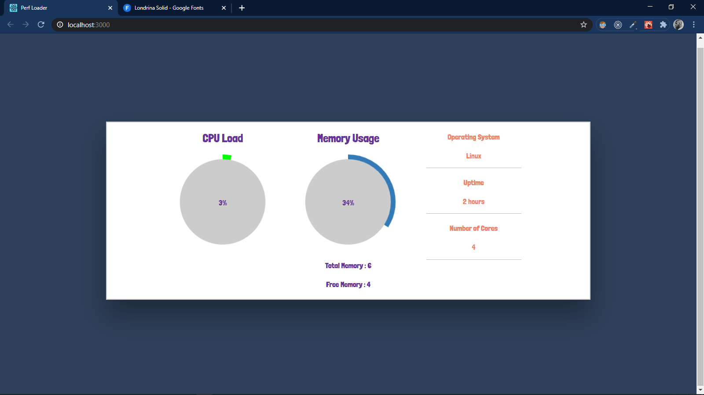

# Performance Load

---

This is the "Performance Load" project written in Javascript and socket.io and its Real time app and uses a client socket on the server to monitor the cpu and memory and show them on a canvas in the front-end as realtime and its scalable app and uses the redis server do that and switch to long polling ajax request to be able to work with it you need to go to "client" , "nodeClient","server" and "npm install" and you need to have "redis" and "mongodb" running in background

---

## Installing

`npm install`
run it in **'client'** **'server'** **'nodeClient'**

after that you need a **Redis Server** running in background
and also **MongoDB**

after all of those steps go to the root of the project and run
`npm start`

---

## Built With

- Nodejs
- Express
- MongoDB
- Socket.io
- Mongoose
- React
- Redis
